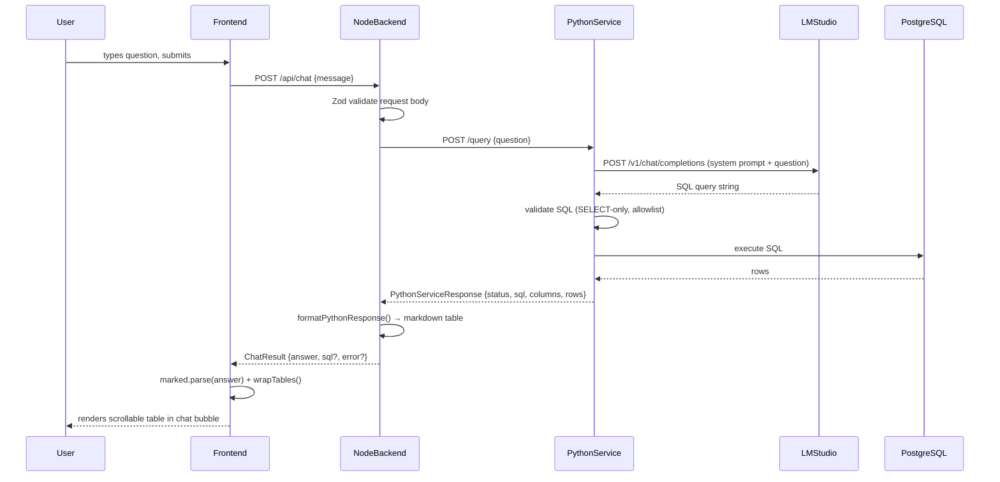

# Architecture: Tally Chat MCP

## Overview

Tally Chat MCP is a natural-language chat interface for Tally Prime accounting data. A business owner types a question in English or Hindi, the frontend sends it to a Node.js backend, which delegates to a Python service that generates SQL via a local LLM (Qwen2.5-Coder-7B), executes it safely against PostgreSQL, and returns a formatted markdown table. The frontend renders the response as a scrollable, sticky-first-column table inside a chat bubble.

---

## Project Structure

```
tally-chat-mcp/
├── backend/                        # Fastify Node.js API server (port 3001)
│   ├── src/
│   │   ├── server.ts               # Fastify bootstrap, routes, CORS
│   │   ├── config.ts               # Zod-validated environment variables
│   │   ├── index.ts                # Entry point — starts the server
│   │   ├── routes/
│   │   │   └── chat.ts             # processChatMessage() — core request handler
│   │   ├── llm/
│   │   │   ├── client.ts           # OpenAI SDK client pointed at LM Studio
│   │   │   ├── schema-loader.ts    # buildSystemPrompt() — DB schema + rules, in-memory cache
│   │   │   └── sql-generator.ts    # Calls LLM, returns raw SQL string
│   │   ├── sql-safety/
│   │   │   └── validator.ts        # validateSql() — AST + regex allowlist (SELECT-only, 41 tables)
│   │   ├── formatters/
│   │   │   └── result.ts           # formatPythonResponse() — columns+rows → markdown table
│   │   └── db/
│   │       ├── kysely.ts           # Kysely instance + rawQuery() helper
│   │       └── dialect.ts          # pg dialect configuration
│   ├── tests/                      # Vitest unit + integration tests
│   ├── package.json
│   └── tsconfig.json
│
├── frontend/                       # SolidJS + Vite app (port 3000)
│   ├── src/
│   │   ├── index.tsx               # SolidJS app mount
│   │   ├── App.tsx                 # Root component — message state, scroll, handleSend
│   │   ├── index.css               # Tailwind v4, prose styles, table scroll, sticky column
│   │   ├── api/
│   │   │   └── chat.ts             # sendMessage() fetch wrapper, Message/ChatResponse types
│   │   └── components/
│   │       ├── MessageBubble.tsx   # User/assistant bubbles, wrapTables(), marked rendering
│   │       └── QueryInput.tsx      # Textarea + send button
│   ├── public/icons/               # bot.png, send-message.png
│   ├── index.html
│   ├── vite.config.ts
│   ├── package.json
│   └── tsconfig.json
│
├── tally-knowledge/                # Domain reference docs (not served — dev reference only)
│   ├── overview.md
│   ├── account-ledger.md
│   ├── trial-balance.md
│   └── ...                         # sales, purchase, bills, stock reports
│
├── docs/
│   ├── ARCHITECTURE.md             # This file
│   └── DECISIONS.md                # Architectural decision log
│
├── plan/                           # Implementation plans and notes
├── error/                          # Captured error logs and debug artifacts
├── CLAUDE.md                       # AI assistant project context and coding rules
├── FEATURE_LOG.md                  # Feature history (max 15 entries)
└── .env.example                    # Environment variable template
```

---

## Frontend Architecture

### Component Tree

```
App.tsx
├── header                          # Avatar, "Tally Chat" title, "Connected" indicator
├── main (message list)
│   ├── date separator pill
│   ├── For each message → MessageBubble
│   │   ├── Assistant bubble (left-aligned)
│   │   │   ├── bot avatar img
│   │   │   ├── .prose div
│   │   │   │   └── wrapTables(marked.parse(content))
│   │   │   │       └── .table-wrap > table (scrollable, sticky col 1)
│   │   │   └── timestamp
│   │   └── User bubble (right-aligned)
│   │       ├── message text
│   │       └── timestamp + double-check icon
│   └── typing indicator (when loading)
└── QueryInput
    ├── textarea
    └── send button
```

### State Management

| Signal | Type | Location | Purpose |
|---|---|---|---|
| `messages` | `Message[]` | `App.tsx` | Full chat history |
| `loading` | `boolean` | `App.tsx` | Controls typing indicator and input disabled state |

### Key Functions

| Function | File | Description |
|---|---|---|
| `handleSend(text)` | `App.tsx` | Appends user message, calls `sendMessage()`, appends response |
| `sendMessage(msg, history)` | `api/chat.ts` | `POST /api/chat`, returns `ChatResponse` |
| `wrapTables(html)` | `MessageBubble.tsx` | Wraps every `<table>` in `<div class="table-wrap">` for scoped scroll |

### Table Rendering Chain

```
markdown string (from backend)
  → marked.parse()           converts markdown to HTML string
  → wrapTables()             injects <div class="table-wrap"> around every <table>
  → innerHTML on .prose div  rendered into DOM
  → CSS: .table-wrap         overflow-x: auto — scoped horizontal scroll
  → CSS: th:first-child      position: sticky; left: 0 — pinned first column
```

---

## Backend Architecture

### Request Handler Flow (`routes/chat.ts`)

```
processChatMessage(message)
  1. POST {PYTHON_SERVICE_URL}/query  {question: message}
  2. Receive PythonServiceResponse
     - status: 'success' | 'non_sql' | 'max_retries' | 'api_error'
     - sql, columns, rows, rows_returned, message, attempts
  3. Map status → ChatResult {answer, sql?, error?}
     - success + rows  → formatPythonResponse(columns, rows) → markdown table
     - success + empty → "no data" message
     - non_sql         → "could not generate query" message
     - max_retries     → error with attempt count
     - api_error       → "service unavailable" message
  4. Return ChatResult to server.ts → HTTP 200
```

### SQL Validation (`sql-safety/validator.ts`)

All LLM-generated SQL passes through a two-stage validator before execution:

1. **Fast-fail checks** — rejects if: contains `;` (multi-statement), matches `INSERT|UPDATE|DELETE|DROP|CREATE|ALTER|TRUNCATE|GRANT|REVOKE|EXEC`, or does not start with `SELECT` or `WITH`
2. **AST validation** — `node-sql-parser` parses into AST, confirms `type === 'select'`, checks all referenced tables against the 41-table allowlist
3. **Regex fallback** — if the AST parser fails on valid PostgreSQL (CTEs, complex subqueries), falls back to regex-based `FROM`/`JOIN` table extraction against the same allowlist

### System Prompt Cache (`llm/schema-loader.ts`)

`buildSystemPrompt()` queries `information_schema.columns` on first call, builds a prompt containing:
- Role definition and output rules (SQL-only, no explanations)
- Indian fiscal year and date calculation rules
- Amount sign conventions for `trn_accounting`
- Mandatory voucher filters (exclude order/inventory vouchers)
- Key table relationships and semantic mappings
- Few-shot SQL examples (English + Hindi)
- Live DB schema (all tables and columns)

The result is cached in-memory as `cachedPrompt`. Call `invalidateSchemaCache()` to rebuild after a schema change.

### Result Formatter (`formatters/result.ts`)

`formatPythonResponse(columns, rows)` produces a GitHub-flavoured markdown table:

```
| col1 | col2 | col3 |
| --- | --- | --- |
| val  | val  | val  |
```

Capped at 50 rows by default. If truncated, appends `*Showing 50 of N results*`.

---

## End-to-End Request Flow



---

## External Services

| Service | Type | Default URL | Purpose |
|---|---|---|---|
| LM Studio | Local LLM server | `http://localhost:1234` | OpenAI-compatible API serving `qwen2.5-coder-7b-instruct` |
| Python service | Local HTTP service | `http://localhost:8001` | LLM-to-SQL pipeline + DB execution |
| PostgreSQL | Database | via `DATABASE_URL` | Tally Prime accounting data store |

### LM Studio Configuration

- Model: `qwen2.5-coder-7b-instruct` — 95.73% SQL accuracy, 80+ languages including Hindi
- Context window: must be set to **8192** in LM Studio (prevents SQL truncation on complex CTEs)
- Temperature: `0.1` (near-deterministic for SQL generation)

---

## Key Database Tables

The SQL validator allowlist contains 41 tables grouped by prefix:

| Prefix | Tables | Purpose |
|---|---|---|
| `mst_*` | `mst_group`, `mst_ledger`, `mst_vouchertype`, `mst_uom`, `mst_godown`, `mst_stock_category`, `mst_stock_group`, `mst_stock_item`, `mst_cost_category`, `mst_cost_centre`, `mst_attendance_type`, `mst_employee`, `mst_payhead`, `mst_gst_effective_rate`, `mst_opening_batch_allocation`, `mst_opening_bill_allocation`, `mst_stockitem_standard_cost`, `mst_stockitem_standard_price` | Master data — accounts, ledgers, items, groups |
| `trn_*` | `trn_voucher`, `trn_accounting`, `trn_inventory`, `trn_cost_centre`, `trn_cost_category_centre`, `trn_cost_inventory_category_centre`, `trn_bill`, `trn_bank`, `trn_batch`, `trn_inventory_additional_cost`, `trn_employee`, `trn_payhead`, `trn_attendance`, `trn_closingstock_ledger` | Transaction data — vouchers, entries, bills |
| Normalized | `companies`, `groups`, `ledgers`, `stock_groups`, `stock_items`, `vouchers`, `voucher_entries`, `sync_history`, `config` | Multi-tenant / sync support |

### Core Relationships

```
trn_accounting.guid        → trn_voucher.guid
trn_accounting.ledger      → mst_ledger.name
trn_inventory.guid         → trn_voucher.guid
trn_inventory.item         → mst_stock_item.name
trn_bill.guid + ledger     → trn_accounting (composite)
mst_ledger.parent          → mst_group.name
mst_group.primary_group    → top-level Tally group (e.g. 'Sales Accounts')
```

---

## Environment Variables

All variables are validated at startup via Zod in `backend/src/config.ts`. Server refuses to start if any required variable is missing or invalid.

| Variable | Type | Default | Description |
|---|---|---|---|
| `DATABASE_URL` | `string` | required | PostgreSQL connection string |
| `DB_TYPE` | `'postgres' \| 'mysql'` | `'postgres'` | Database dialect |
| `LLM_BASE_URL` | `string (URL)` | required | LM Studio base URL (e.g. `http://localhost:1234/v1`) |
| `LLM_MODEL` | `string` | required | Model name (e.g. `qwen2.5-coder-7b-instruct`) |
| `LLM_MAX_TOKENS` | `number` | `1024` | Max tokens for LLM response |
| `LLM_TEMPERATURE` | `number` | `0.1` | LLM sampling temperature |
| `PORT` | `number` | `3001` | Backend HTTP server port |
| `CORS_ORIGIN` | `string` | `http://localhost:3000` | Allowed CORS origin |
| `PYTHON_SERVICE_URL` | `string (URL)` | `http://localhost:8001` | Python query service base URL |

Frontend environment variables (must be prefixed `VITE_`):

| Variable | Default | Description |
|---|---|---|
| `VITE_API_URL` | `http://localhost:3001` | Backend base URL |

---

## Ports & URLs Quick Reference

| Service | Port | URL |
|---|---|---|
| Frontend (Vite dev) | 3000 | `http://localhost:3000` |
| Backend (Fastify) | 3001 | `http://localhost:3001` |
| Python service | 8001 | `http://localhost:8001` |
| LM Studio | 1234 | `http://localhost:1234` |
| PostgreSQL | 5432 | via `DATABASE_URL` |

### API Endpoints

| Method | Path | Description |
|---|---|---|
| `POST` | `/api/chat` | Send a chat message, receive `{answer, sql?, error?}` |
| `GET` | `/health` | Health check — returns `{status: "ok"}` |

---

## Key Architectural Decisions

See [docs/DECISIONS.md](docs/DECISIONS.md) for the full decision log.

Notable decisions embedded in the architecture:

- **Two independent apps** (`backend/`, `frontend/`) with separate `node_modules` — avoids pnpm workspace monorepo issues with Tailwind v4 module graph scanning
- **Python service as intermediary** — LLM-to-SQL pipeline and DB execution are delegated to a Python service; the Node backend is a thin proxy + formatter
- **In-memory prompt cache** — DB schema is loaded once at startup and cached; `invalidateSchemaCache()` exists for manual invalidation after schema changes
- **SQL validation is defence-in-depth** — Python service validates too, but the Node backend's `validateSql()` provides an independent second layer before any DB call would occur
- **`marked` + `wrapTables()`** — markdown tables from the LLM are rendered client-side via `marked`; the `wrapTables()` string transform injects scroll wrappers post-parse rather than customising the marked renderer, keeping the rendering pipeline simple
